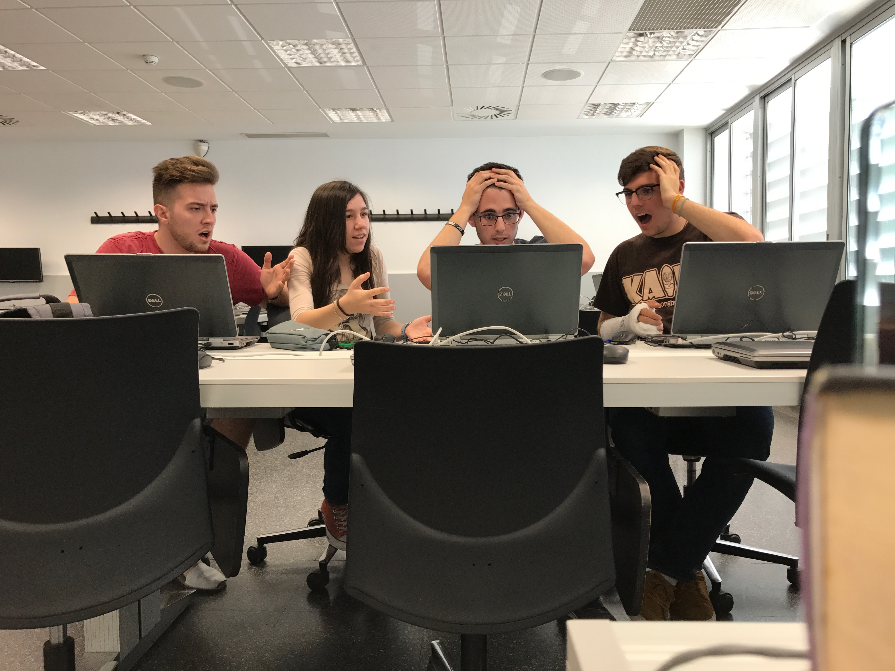

## Our project 

We're going to replicate the 1994 Gunbird game arcade version developed and published by Psyko as a tribute to the game. This project has been done by four catalan students of CITM - UPC (Terrasa, Spain). 

## About the game

Gunbird was released in 1994 for arcades and belongs to the vertically scrolling shoot'em up genre and has both single-player and two-player cooperative modes.

The game allows you to choose between five different characters, each one with their own skills and powers. The objective of the game is to obtain the four shards  of a magic mirror in order to get a wish once they are all assembled. They will fight against The Trump (a group of three pirates) for the fragments of the mirror.

There are two loop with seven levels each. The four shards of the mirror are obtained in the first four levels (which are randomly selected) and the wish is made once the player has completed three extra levels. In the end of each level you’ll have one boss to beat and a piece of the main plot is revealed. But in the second loop the difficult is increased and the story plot is removed.

## Gameplay

<iframe width="740" height="590" src="https://www.youtube.com/embed/yBFzOEv0snY" frameborder="0" allowfullscreen></iframe>

## Controls
~~~~~~~~~~~~~~~

Keyboard Player 1 controls:
- UP: W key
- LEFT / MOVE SELECTOR LEFT: A key
- RIGHT / MOVE SELECTOR RIGHT:: D key
- DOWN: S key
- BASIC SHOT: SPACE key
- SELECT CHARACTER: SPACE key 
- BOMB: B key

Keyboard Player 2 controls:
- UP: UP_ARROW key
- LEFT / MOVE SELECTOR LEFT: LEFT_ARROW key
- RIGHT / MOVE SELECTOR RIGHT:: RIGHT_ARROW key
- DOWN: DOWN_ARROW key
- BASIC SHOT: 1 key (NUMPAD)
- JOIN THE GAME: 2 key (NUMPAD)
- JOIN THE GAME (in-game): 1 key (NUMPAD)
- SELECT CHARACTER: 1 key (NUMPAD)
- BOMB: 2 key (NUMPAD)

General controls:
- SKIP SCREEN: SPACE key
- EXIT GAME: ESC key

Gamepad:

- MOVE: JOYSTIC AND D-PAD
- SHOOT AND SELECT CHARACTER: A 
- SKIP SCREEN: A
- BOMB: B
- START GAME: START
- EXIT GAME: BACK

~~~~~~~~~~~~~~~

# FrozenSloth Studios - Our team

## Team members

_Altimira Bernat, Martí's responsability and Github account_

* QA
* [Github account](https://github.com/martimab)

_García Subirana, Guillermo's responsability and Github account_

* Code
* [Github account](https://github.com/Wilhelman)

_Masó Garcia, Víctor's responsability and Github account_

* Management
* [Github account](https://github.com/nintervik)

_Termens Vázquez, Ariadna's responsability and Github account_

* Art/Design
* [Github account](https://github.com/AriTeva)

### For more information see our wiki page [HERE](https://github.com/Wilhelman/Gunbird_P01/wiki)
### Download the last version of the game [HERE](https://github.com/Wilhelman/Gunbird_P01/releases/tag/v1.0)
### Check our Github repository [HERE](https://github.com/Wilhelman/Gunbird_P01)

#### _Tribute by FrozenSloth Studios_
